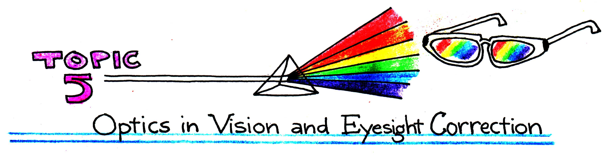

## Introduction

The eye is able to detect light over a range of brightness of ten billion to one. It can bring into focus both starlight from millions of light-years away and light reflected from this page, about 20 cm away.  The shape and optical properties of the eye allow light entering the iris to form an image on the back surface of the eye called the retina.  Two types of photoreceptive cells on the retina, the rods and the cones, are responsible for interpreting brightness and color.  

We will first review the principles of optics and apply them to the eye.  Then we will discuss vision problems associated with small aberrations in the shape of the eye and how corrective eyewear and surgery can improve vision.

## Geometrical Optics: A Review

### Properties of Light
In a vacuum, all electromagnetic waves, including visible light, travel at a singular speed ($3.0\times10^8$ m/s).  The speed of light in air is approximately the same, but in water and other dense transparent media, it travels significantly slower.  The index of refraction, denoted by $n$, is the ratio of the speed of light c in vacuum to the speed of light $v$ in the material:
\begin{equation}\label{eqn5-1}
n = \frac{c}{v}
\end{equation}
Note that the larger the value of $n$, the slower the speed of light in the medium. The value of $n$ is always greater than 1 because light is limited to its vacuum speed. We will approximate the index of refraction in air to 1 and in water to 1.33.

The speed of light waves in a medium $v$ is related to frequency $f$ and wavelength $\lambda$ according to the well-known equation 
\begin{equation}\label{eqn5-2}
v = \lambda f
\end{equation}
As light passes from one medium to another, frequency remains constant.  Consequently, according to Eqn. {eq}`Fig5-2`, the wavelength must decrease as the speed v decreases and vice-versa.  [](#Fig5-1) illustrates this effect as light waves pass from air into glass.  
```{figure} ./images/Topic5/Fig5-1.jpg
:width: 80%
:align: center
:alt: Effect of light passing from a less dense medium (air) to a more dense medium (glass).  The wave slows down and the wavelength decreases.
:label: Fig5-1
Effect of light passing from a less dense medium (air) to a more dense medium (glass).  The wave slows down and the wavelength decreases.
```
When light strikes the surface of a transparent medium at an angle other than normal incidence, it is bent at the boundary (see [](#Fig5-2)). This bending of light due to a change in wave speed is called refraction. Effect of light passing from a less dense medium (air) to a more dense medium (glass).  The wave slows down and the wavelength decreases.
```{figure} ./images/Topic5/Fig5-2.png
:width: 80%
:align: center
:alt: Refraction at the interface of air and glass.   Note that the wavelength still shortens to compensate for decreased wave speed.
:label: Fig5-2
Effect of light passing from a less dense medium (air) to a more dense medium (glass).  The wave slows down and the wavelength decreases.
```
The ability to bend light can be exploited to focus light using the effect illustrated in Fig. 2. For instance, some focusing can be achieved with the crude lens design shown in [](#Fig5-3), although not very effectively since not all portions of the incoming wave converge to a single point. A better design is achieved with a spherical surface, which is the shape that most is lenses utilize. 
```{figure} ./images/Topic5/Fig5-3.png
:width: 80%
:align: center
:alt: Crude lensing effect created by a piece of glass with a triangular profile.
:label: Fig5-3
Effect of light passing from a less dense medium (air) to a more dense medium (glass).  The wave slows down and the wavelength decreases.
```

As we shall see, different parts of the eye have different indices of refraction and spherical shapes. Together they form a system capable of focusing light from near or distant objects and still produce a clear image on the retina.

### Thin Lenses 

The focal point of a lens is defined as the point at which parallel incoming rays (like from a distant light source or a laser) converge. For thin lenses, focal length f is the distance from the focal point and the center of the lens.  
There are two main types of thin lenses: converging (positive) lenses and diverging (negative) lenses.  Converging lenses, also called focusing lenses, are thicker at their center than at their edges and have a positive focal length; diverging lenses are thicker at their edges than at their centers and have a negative focal length.  [](#Fig5-4) shows that parallel rays entering a converging lens from the left converge at the focal point on the outgoing (right) side of the lens.   Also shown in [](#Fig5-4) are parallel light rays entering a diverging lens.  If we were to extend the diverging rays back to the left, they would appear to intersect (converge) at the focal point on the incoming side of the lens.  As this focal point is on the side opposite to the outgoing light, the focal length is negative.  
```{figure} ./images/Topic5/Fig5-4.jpg
:width: 100%
:align: center
:alt: Left: light rays entering a converging (positive) lens.  Right: light rays entering a diverging (negative) lens.
:label: Fig5-4
Effect of light passing from a less dense medium (air) to a more dense medium (glass).  The wave slows down and the wavelength decreases.
```

As the distant source moves closer, as shown in [](#Fig5-5)a and [](#Fig5-5)b, the focal point moves farther away from the lens. If $s$ is the distance from the object (light source) to the lens and $s'$ is the distance from the lens to the image (focus), $s$ and $s'$ are related to $f$ by the thin lens equation.
\begin{equation}\label{eqn5-3}
\frac{1}{f} = \frac{1}{s} + \frac{1}{s'}
\end{equation}
[](#Fig5-5)a and [](#Fig5-5)b also illustrate a crucial point about the ability of a lens to focus light from objects at varying distances. Suppose our eyesight is focused on a distant object to such that it produces a sharp image on the retina, located at the focal point of [](#Fig5-5)a. Now consider what would happen if the object moved closer and the image distance shifts as shown in [](#Fig5-5)b. The image should no longer be in focus on the retina, implying that the image should look fuzzy now. The only way to overcome this problem, that is, to keep the image in the same location, would be to decrease the focal length of the lens by making it more spherical as suggested in [](#Fig5-5)c. 
```{figure} ./images/Topic5/Fig5-5.png
:width: 100%
:align: center
:alt: Effects of image distance and lens shape on the location of the image distance.
:label: Fig5-5
Effect of light passing from a less dense medium (air) to a more dense medium (glass).  The wave slows down and the wavelength decreases.
```
As we shall see shortly, our eyesight possesses a mechanism that alters its focal length as needed to accommodate different objects distances.

### Refractive Power

The strength of convergence of a lens depends on its refractive power, which is defined as the reciprocal of the focal length $f$ given in meters:
\begin{equation}\label{eqn5-4}
P = \frac{1}{f}
\end{equation}
The unit of power is the diopter, where 1 diopter = 1 m-1.  Figure 6 compares the power of three different lenses. 
```{figure} ./images/Topic5/Fig5-6.jpg
:width: 100%
:align: center
:alt: The power of a lens with focal length $f$ = 1 m is $P$ = 1 diopter; $f$ = 0.5 m, $P$ = 2 diopters; $f$ = 0.1 m, $P$ = 10 diopters.
:label: Fig5-6
Effect of light passing from a less dense medium (air) to a more dense medium (glass).  The wave slows down and the wavelength decreases.
```
When two or more lenses are combined, the resulting refractive power is equal to the sum of the refractive powers of each lens.
\begin{equation}\label{eqn5-5}
P_{total} = \frac{1}{f_{lens1}}+\frac{1}{f_{lens2}}+\frac{1}{f_{lens3}}+\cdots
\end{equation}
Refractive power depends not only on the curvature of both surfaces of the lens, but also on the indices of refraction of the lens and the outside medium.  
\begin{equation}\label{eqn5-6}
P = \frac{1}{f} = \left(n_{lens}-n_{medium}\right)\left(\frac{1}{R_1}-\frac{1}{R_2}\right)
\end{equation}
where $R_1$ is the radius of curvature of the first surface light encounters as it passes through the lens, while $R_2$ is the radius of curvature of the exiting surface.  When the center of curvature points in the direction of light, as is the case for $R_1$ in [](#Fig5-7), its value is positive. Conversely, when the center of curvature points in the direction opposite to that of light, as is the case for $R_2$ in [](#Fig5-7), its value is negative. Equation (6) is called the lensmaker's equation.
```{figure} ./images/Topic5/Fig5-7.png
:width: 80%
:align: center
:alt: Diagram of a lens for using the lensmaker's equation (Eqn.~(6)).
:label: Fig5-7
Effect of light passing from a less dense medium (air) to a more dense medium (glass).  The wave slows down and the wavelength decreases.
``` 

## Optics of the Eye and Vision

With this background in optics, we are now ready to examine the optical components of the eye.  [](#Fig5-8) gives the indices of refraction for the optical materials through which light must pass.
```{figure} ./images/Topic5/Fig5-8.png
:width: 90%
:align: center
:alt: Optical components of the eye and their indices of refraction.
:label: Fig5-8
Effect of light passing from a less dense medium (air) to a more dense medium (glass).  The wave slows down and the wavelength decreases.
```
The components of the eye are as follows:
* **Cornea**.  The cornea is an optically clear membrane that holds in place the fluids inside the eye.  It is roughly spherical in shape.
* **Pupil**.  The pupil is the aperture through which light passes.  Its diameter can vary from 1.5 mm to 8.0 mm, controlling the amount of light reaching the back of the eye by a factor of about 30.  As we will see, the diameter of the pupil has a significant impact on the perceived field depth and clarity of an object.
* **Iris**.  The iris is the colored muscle surrounding the pupil.  When it contracts, the pupil dilates (becomes bigger), allowing more light to enter the eye.  When it relaxes, the pupil constricts.  The iris is often compared to the diaphragm of a camera.
* **Aqueous humor and vitreous humor**.  The aqueous and vitreous humors are the fluids that keep the eye inflated.  The aqueous humor, between the cornea and the lens, consists mainly of water.
* **Crystalline lens**.  The lens is composed of a strong elastic membrane that encapsulates a viscous, protein-rich substance.  Its spherical shape is controlled by a muscle.  When the muscle contracts, the lens thickens, increasing the refractive power of the lens.  This is what allows us to see objects up close.  When the ciliary muscle relaxes, the lens flattens, making distance vision possible.
* **Retina**.  The retina is the layer of tissue lining the back of the eye.  It is covered with two types of light receptors called rods and cones.  These receptors convert light into nerve impulses that travel to the visual cortex where they are interpreted.
 
### Refractive Power of the Eye

The lens and the cornea are the components of the eye most responsible for refraction.  We will now find the refractive power of each component separately and then find the total refractive power of the eye by summing these values.
The refractive power of the eye is due mostly to refraction from air to the aqueous humor, which is dictated by the shape of the cornea.  It can be calculated using Eqn. {eq}`Fig5-6`.  Since the cornea only has one surface, $R_1$ is simply the radius of curvature of this surface ($\sim$ 8 mm. FYI this is one of the numbers characterizing contact lenses so that they fit properly.), and $R_2$ is infinity.  Approximating the index of refraction of the aqueous humor is 1.33, we see that 
$$P = \left(1.33 - 1.00\right)\left(\frac{1}{0.008}-\frac{1}{\infty}\right) = 41.25~{\rm diopters}.$$
We also use Eqn. {eq}`Fig5-6` to calculate the refractive power of the lens.  The radii of curvature $R_1$ and $R_2$ for the lens in the eye are 0.0102 and -0.0060 m respectively, when the eye focuses on distant objects. The index of refraction of the lens is equal to 1.40, while that of the surrounding medium is 1.33 and 1.34 on either side. For simplicity we will average these two values and set the average index of refraction of the lens to be 1.335. Thus,  
$$P = \left(1.40 - 1.335\right)\left(\frac{1}{0.0102}+\frac{1}{0.006}\right) = 17.20~{\rm diopters}.$$
Thus, by Eqn. {eq}`Fig5-5`, the total refractive power of the eye is about 58 diopters.  Note that this value was calculated for an eye focusing on distant objects.

### Accomodation
To focus clearly on nearby objects, the eye must increase its total refractive power.  As mentioned earlier, it accomplishes this by changing the shape of the lens, a process called accommodation.  [](#Fig5-9) illustrates how accommodation occurs.
```{figure} ./images/Topic5/Fig5-9.png
:width: 100%
:align: center
:alt: Mechanism of accommodation.
:label: Fig5-9
Effect of light passing from a less dense medium (air) to a more dense medium (glass).  The wave slows down and the wavelength decreases.
```  
The ciliary muscle is attached to the suspensory ligaments, which hold the lens in place.  When the ciliary muscle relaxes and expands, it pulls the ligaments away from the lens. The resulting increased tension on the lens causes it to assume the flattened shape needed for distance vision.  When the ciliary muscle contracts, the ligaments are forced inwards, causing the lens to assume a more spherical shape in which the radii of curvature increase.  This allows the eye to focus on nearby objects.  Through accommodation, the refractive power of the lens can increase from 17 diopters up to 31 diopters, a 14 diopter increase from normal refractive power.  Thus, it is said that the lens has an accommodation power of 14 diopters.
 
As we age, the lens slowly grows and loses its elasticity.  When this occurs, the ciliary muscle cannot cause it to assume a spherical shape as easily, and accommodation power diminishes. [](#table5-1) shows the average accommodation power for several age groups.
:::{table} Accommodation power diminishes with age.
:label: table5-1
:align: center
|   Age     |  Accomodation Power (diopters) |
| :-------  |       :------------:           |
|  Children |          14                    |
|   18-22   |         11-12                  |
|   45-50   |          2-4                   |
|   60-70   |          0-1                   |
:::
This phenomenon is inevitable — it is the reason people begin to wear reading glasses when they reach middle age.

### Visual Acuity

Visual acuity is defined as ability to visually resolve fine detail. The most common measure of acuity is the Snellen chart, such as the one shown in [](#Fig5-10), which identifies what a person can see at 20 feet relative to what person with normal eyesight can see x feet way. Thus, 20/20 is normal, whereas 20/200 is regarded as very poor eyesight. Contacts, eyeglass, and surgery can improve many of the eye’s refractive errors that cause poor visual acuity. In some cases however, the best eyesight correction that can be afforded is 20/200, at which point one is classified as legally blind.
```{figure} ./images/Topic5/Fig5-10.png
:width: 400px
:align: center
:alt: A typical Snellen chart used by optometrist to determine visual acuity.
:label: Fig5-10
A typical Snellen chart used by optometrist to determine visual acuity.
```

In order to see the letters on the chart corresponding to 20/20, an eye must have the ability to revolve points separated by as little as an arc minute (= 1/60 of a degree or $2.9\times10^{-4}$ radians. To put it into perspective, consider two small light sources separated by a distance x = 1 cm, as shown in [](#Fig5-11). As you step back from those two sources by a distance l, the angle $\theta$ decreases and eventually reaches the limit of visual resolution, i.e.,  $\theta = 2.9\times10^{-4}$ radians. At this point, the corresponding distance $L$ is related to the angle $\theta = 2.9\times10^{-4}$ radians and $x$ by $\tan(2.9\times10^{-4}$ radians) = 1cm/$L$, from which we obtain a distance $L$ of 34 meters (100 ft). 

```{figure} ./images/Topic5/Fig5-11.jpg
:width: 100%
:align: center
:alt: Diagram demonstrating the relevant variables for resolving two objects spaced a distance $x$ apart and a distance $L$ away from the viewer.
:label: Fig5-11
Effect of light passing from a less dense medium (air) to a more dense medium (glass).  The wave slows down and the wavelength decreases.
```

As we shall see now, the above limit of visual acuity is largely due to the wave nature of light. Before we discuss this interesting feature we must first consider how far apart those two luminous objects are when imaged on the retina. To calculate this distance we can make use of the relation between object and image sizes introduced in your Introductory Physics class
$$\frac{\rm Image~Height}{\rm Object~Height} = \frac{\rm Image~Distance}{\rm Object~Distance}$$
or
$$\frac{\rm Image~Height}{x}=\frac{\rm Image~Distance}{L}$$
Here the image distance corresponds to the distance between the cornea and the retina, which is roughly 1.7 cm. Therefore,
$$\frac{\rm Image~Height}{1~{\rm cm}}=\frac{1.7~{\rm cm}}{3400~{\rm cm}}$$
From the above equation one can work out that the separation between the imaged light sources on the retina (the image height) is about 5 $\rm \mu$m.  The question then is how this distance is related to the diffraction limit.

Diffraction, as you may recall, is the phenomenon that describes how waves spread out as they propagate.  [](#Fig5-12) below shows a diffraction pattern from light entering a small aperture.  Plane waves entering the aperture from the left appear collimated at first, but rapidly evolve into a cone of diverging waves.
```{figure} ./images/Topic5/Fig5-12.png
:width: 80%
:align: center
:alt: Diffraction produced as a wave passes through an aperture.
:label: Fig5-12
Effect of light passing from a less dense medium (air) to a more dense medium (glass).  The wave slows down and the wavelength decreases.
```
If $\theta$ is half the angle of divergence, $D$ is the size of the aperture, and $\lambda$ is the wavelength of light, diffraction theory predicts that these quantities are related by the formula
\begin{equation}\label{eqn5-7}
D = \frac{1.22\lambda}{\theta}
\end{equation}
One of the beautiful things about the laws of physics is that they are time reversible. That is, if you were to reverse the time evolution of diffraction the same way you would reverse the footage in a movie, the backwards movement still obeys the laws of physics. We can extend this simple principle to our present situation and conclude that when waves are focused into a cone of half angle $\theta$ they will focus to a spot with a size $D$. The size of the spot $D$ is dictated by the half-angle of convergence $\theta$ and the wavelength $\lambda$ dictate according to Eqn. {eq}`Fig5-7`.

The implication for the eye is illustrated with Fig. 13. The optics in the eye produces a converging wave with a half angle that is dictated by the size of the pupil. 
```{figure} ./images/Topic5/Fig5-13.png
:width: 100%
:align: center
:alt: The point of focus on the retina is finitely sharp due to diffraction.
:label: Fig5-13
Effect of light passing from a less dense medium (air) to a more dense medium (glass).  The wave slows down and the wavelength decreases.
```  
Let $q$ be the diameter of the pupil (in bright light, $q$ = 1.5 mm), $l$ be the distance from the pupil to the retina (1.5 cm), and $\theta$ be half the angle formed by the cone of light entering the eye.  Since $\tan\theta=q/2l$, and by the small angle approximation $\tan\theta\approx\theta$, we see that $\theta\approx0.05$ radians.  If we assume that the incoming light has wavelength 500 nm, the smallest point of light on the retina is found by solving for $D$:
$$D = \frac{1.22\lambda}{\theta}=\frac{1.22\cdot 5\times10^{-7}}{0.05}.$$
So let us see how this spot size relates to our earlier calculation of the separation between the retinal images of two light sources at the limit of visual acuity. The spot size appears to be a factor of two larger than the estimated separation of 5 um, and for a good reason. When two spots are separated by a full spot size as depicted in [](#Fig5-14), upper panel, the eye has no difficulty resolving those as separate spots. It is only when the edge of one spot overlaps with the center of the other that the eye begins to have difficulty resolving the two as separate spots. This limit for the resolution of two spots is known as the Rayleigh criterion.
```{figure} ./images/Topic5/Fig5-14.jpg
:width: 400px
:align: center
:alt: The Rayleigh criterion for minimum resolution.
:label: Fig5-14
Effect of light passing from a less dense medium (air) to a more dense medium (glass).  The wave slows down and the wavelength decreases.
```

From the Rayleigh Criterion we can therefore argue that the minimum resolvable separation between two spots on the retina should be $D/2$, or 6 $\mu$m. This figure is very close to the 5 $\mu$m estimate we inferred from the definition of visual acuity. Diffraction explains why visual acuity is limited even for a person with perfect refractive power.

### Pupillary Diameter Effects

The role of the pupil is to limit the light intensity reaching the cornea.  In bright light, the pupil has a diameter of 1.5 mm.  In dim light, the pupil dilates to 8.0 mm.  This increases the light intensity reaching the retina by a factor of 30. Aside from brightness control, the pupil size can also affect visual acuity.  You may have experienced this effect if your eyesight is not perfect: you seem to see more clearly in bright light than in dim light. [](#Fig5-15) explains the origin of this phenomenon for an eye with less-than-perfect refractive power, which is often the case for most of us. 
```{figure} ./images/Topic5/Fig5-15.png
:width: 80%
:align: center
:alt: The pupil size affects how clear an image will be.
:label: Fig5-15
Effect of light passing from a less dense medium (air) to a more dense medium (glass).  The wave slows down and the wavelength decreases.
``` 
The top image shows light entering the eye through a dilated pupil. If the eye were perfectly refracting, the rays would all converge to a point on the retina and the image would appear sharply focused. Instead the rays converge elsewhere, resulting in rays that are distributed over a small region of the retina. This image is seen by the eye as a fuzzy spot. The bottom image shows how light rays are affected when the pupil contracts. By confining the entering rays to a narrower bundle, the fuzziness of the image is diminished. 

The effect of a small aperture size on visual acuity also accounts for why people tend to squint whenever they try to resolve fine detail. The small aperture created by nearly closed eyelids produces a similar effect to that of a constricted pupil.   

## Eyesight Problems and Correction

The last section on the effects of pupillary diameter touched upon how the shape of the eye affects vision. Emmetropia is the state of the eye when the image is focused exactly on the retina. Hyperopia, or farsightedness, occurs when the eye is too short -- the image is focused behind the retina and appears blurry.  Myopia, or nearsightedness, happens when the eye is elongated so that the image is focused just before the retina.  Also in this case, vision is blurry without correction.  [](#Fig5-16) depicts these three conditions.
```{figure} ./images/Topic5/Fig5-16.png
:width: 80%
:align: center
:alt: Parallel light rays focus on the retina in Emmetropia, behind the retina in Hyperopia, and before the retina in Myopia.
:label: Fig5-16
Effect of light passing from a less dense medium (air) to a more dense medium (glass).  The wave slows down and the wavelength decreases.
```
Since the total refractive power of the eye is the sum of its component refractive powers, we can correct Hyperopia and Myopia by placing extra lenses (eyeglasses or contacts) in front of the eye.  For Hyperopia, a focusing lens adds the extra convergence needed to bring the image into focus on the retina.  For Myopia, a diverging lens adds negative refractive power (divergence) to bring objects into focus.  [](#Fig5-17) shows how these types of correction work.
```{figure} ./images/Topic5/Fig5-17.jpg
:width: 80%
:align: center
:alt: A convex lens corrects Hyperopia, and a concave lens corrects Myopia.
:label: Fig5-17
Effect of light passing from a less dense medium (air) to a more dense medium (glass).  The wave slows down and the wavelength decreases.
```

How do we calculate the necessary refractive power of a lens?  Suppose a nearsighted person can only see clearly to a distance of 20 cm.  We must find the vision correction in diopters that allows this person to see distant objects clearly.  Recall Eqn. {eq}`Fig5-3`, which relates the object distance $s$, the image distance $s'$, and the focal length $f$ by 
$$\frac{1}{f}=\frac{1}{s}+\frac{1}{s'}.$$
For distant objects, the distance $s$ from the object to the lens is infinity.  Thus, the corrected total refractive power should equal $1/s'$.  The correction, denoted by $\Delta P = \Delta\left(1/f\right)$, is simply the difference between the total refractive power for the corrected eyesight and the total refractive power of the nearsighted eye:
\begin{align}
\Delta P &= \frac{1}{f_{corrected}}-\frac{1}{f_{nearsighted}}\nonumber\\
		&=\frac{1}{s'}-\left(\frac{1}{s}+\frac{1}{s'}\right)\nonumber\\
		&= -\frac{1}{s}\nonumber
\end{align}
Since $s$, the maximum distance from the eye to the object where the object will be in focus, is 20 cm in this case, $\Delta P = -1/0.20 = -5$~diopters.

Another common vision problem, astigmatism, arises most often when the cornea is not perfectly spherical.  As a result, the radii of curvature of the cornea’s surface are different when viewed from the top and side, as shown in [](#Fig5-18).
```{figure} ./images/Topic5/Fig5-18.png
:width: 100%
:align: center
:alt: The cornea of an astigmatic eye has different radii of curvature when viewed from the top and side.
:label: Fig5-18
Effect of light passing from a less dense medium (air) to a more dense medium (glass).  The wave slows down and the wavelength decreases.
``` 
Instead of all light rays from a point source focusing at one point, different planes of light focus at different distances, as seen in [](#Fig5-19).
```{figure} ./images/Topic5/Fig5-19.jpg
:width: 100%
:align: center
:alt: Astigmatism. Light rays in different planes focus at different distances depending on how the radius of curvature of the lens varies.
:label: Fig5-19
Effect of light passing from a less dense medium (air) to a more dense medium (glass).  The wave slows down and the wavelength decreases.
```
   
Refractive errors, including astigmatism, can be corrected in several ways. A common way is by using eyeglasses to compensate for deficiencies or excesses of refractive power of the eye. The lenses can be easily tailored to correct for myopia, hyperopia, or astigmatism.  Contact lenses placed directly on the cornea work much like eyeglasses, and can even compensate for astigmatism. Alternatively, the cornea may be reshaped surgically with incisions or laser ablation to achieve the necessary changes in refractive power. This procedure is known as keratotomy. 

## Problems
1. The cornea and lens have a combined focal length of 1.7 cm when the eye focuses on a distant object. 
	* a. What is the corresponding refractive power?
	* b. Suppose that the distant object is now brought to a distance of 20 cm from the eye, while the lens in the eye is still focusing on distant objects. As this happens, the image location shifts from focusing on the retina to a new location theoretically beyond the retina. How far behind the retina will the new image location be?
	* c. What new refractive power must the eye have in order to make the image focus back focus on the retina?
	* d. What change in refractive power (accomodation) does this correspond to? 

2. Suppose a near-sighted person can only see clearly to a distance of 25 cm. What vision correction (in diopters) must this person have in order to see distant objects clearly?

3. [](#Fig5-P3) below depicts what a near-sighted person experiences when she/he tries to focus on distant objects. Rather than seeing images in sharp focus on the retina, the eye sees fuzzy spots of sizes that depend on the level of near-sightedness. Suppose the eye in question needs a vision correction of -5 diopters to see distant point of light clearly. Without this vision correction (the situation shown above), what will the size of that spot be on the retina? (Hint: first find the refractive power of the eye, then find where the focal point is, and finally look at the proportions of the triangles to find the spot size)
```{figure} ./images/Topic5/Fig5-Prob3.png
:width: 100%
:align: center
:alt: The ray diagram of a near-sighted person when they try to focus on distant objects.
:label: Fig5-P3
The ray diagram of a near-sighted person when they try to focus on distant objects.
```
 
 4. Calculate the diffraction-limited spot size on the retina for a normal eye focusing on a very distant object, assuming a pupillary aperture of 2.5 mm and a wavelength of light equal to 650 nm.

5. You are visiting your grandmother. She would like to read the newspaper. However, her near vision has declined with age. To see the news print clearly, she needs the paper to be 40 cm from her eyes compared to the “normal” near point of 25 cm. 
	* a. What correction eyeglasses does she need? Ignore the small distance between the eyeglasses and her eyes. Also, assume the cornea and lens act as a single optical lens.
	* b. The news print is 0.35 cm tall. How tall is the image of the print on the retina of a normal eye with near point of 25 cm?

6. Typically, eyeglasses and contacts have different power corrections for the same person. Which prescription should be stronger for a myopic person, contacts or eyeglasses? Explain why this is true. 
