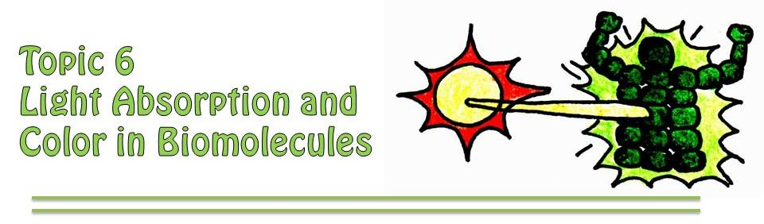
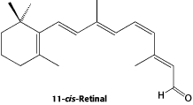
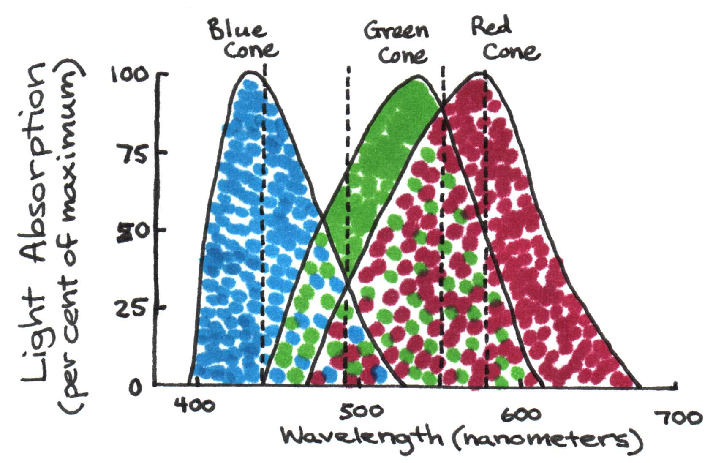
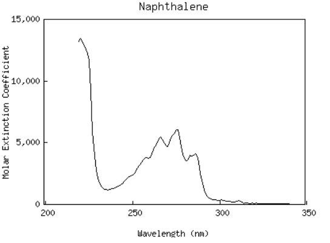
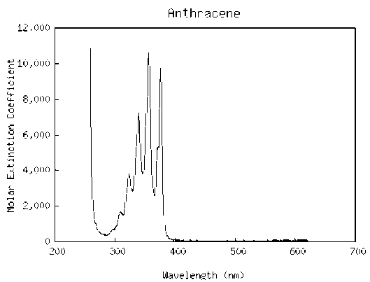
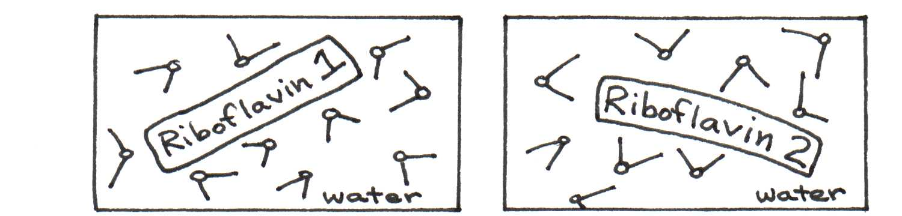
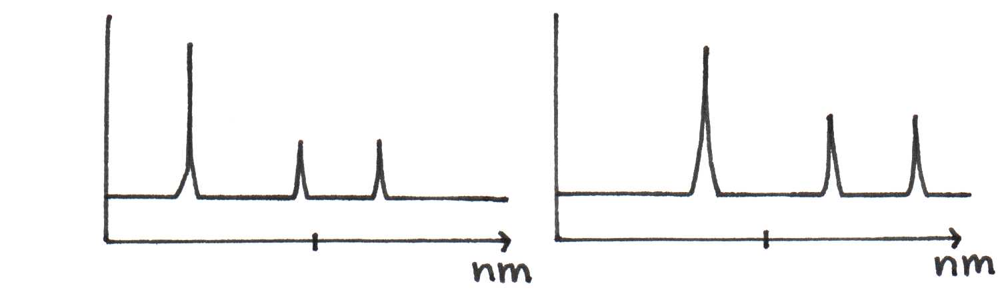
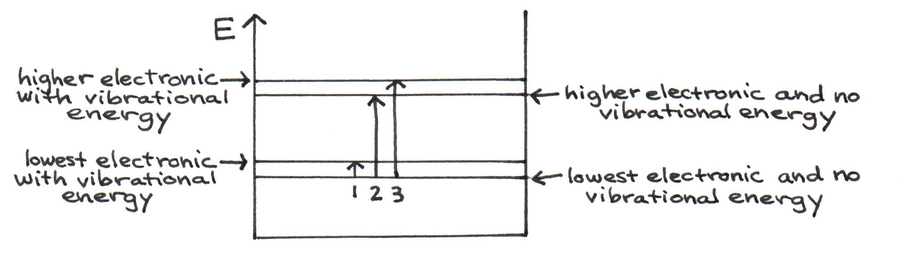

(Topic_6)=
## Introduction

Why are trees green?  Blood red?  Carrots orange?  Most colors in biological tissues arise from natural pigments.  A pigment is a molecule that absorbs visible light of a certain color.  Chlorophyll, the pigment found in plants that allows photosynthesis to occur, appears green because it strongly absorbs blue and red light.  When illuminated with white light (a mixture of all the visible wavelengths) like sunlight, all but green light is absorbed.  The wavelengths that correspond to green are reflected or transmitted through the leaf.  Similarly, heme, the molecule in blood that makes it red, absorbs blue and green light.  Only red light passes through or gets reflected.  We can think of pigments as selective filters that allow only certain wavelengths of light to reach our eyes.

In this chapter, we will consider the quantum mechanical properties that give rise to the coloration of pigments.  

## Pigments and Quantum Mechanics

[](#Fig6-1) gives the structure of several colorful pigments found in plants and algae.
```{figure} ./images/Topic6/Fig6-1.jpg
:width: 100%
:align: center
:alt: Structures for pigments found in carrots, tomatoes, and algae.  Note the high degree of conjugation, i.e., single-double bond repetition.
:label: Fig6-1
Structures for pigments found in carrots, tomatoes, and algae.  Note the high degree of conjugation, i.e., single-double bond repetition.
``` 
Notice that all three pigments have alternating single and double bonds.  Chemists call this property conjugation.  Electrons along the path of conjugation move very freely as they would in metal wires -- nanowires in this case.  
Integral to understanding the properties of electrons inside any confined system is the fact that according to quantum mechanics, every particle in the universe (in other words, all matter) "waves" through space-time.  Here, waving does not mean its trajectory oscillates.  Rather, it refers to a still mysterious property that phases in and out and cannot be observed directly.  If we mathematically square its wave pattern, we get the probability of its existence through space, a property that {\bf can} be observed directly. However difficult these concepts may be to digest, their implication for conjugated systems is relatively simple: since electrons have wave properties like sound waves, and since electrons don’t jump off the pigment when they reach its ends, it must therefore resonate like a sound wave inside a closed-end pipe.  Its resonances should therefore be analogous to those considered in depth in Topic 3. As we shall see, these electron resonances determine which frequencies of light and thus which colors, are absorbed and emitted from pigments.

### Electron Resonances in a Linear Conjugated Molecule

If we treat the electron as a wave inside a molecule of length $L$ (like a closed pipe), what are the resonant modes of oscillation?  Just like sound waves, they must be the waves with wavelengths that allow nodes at both ends of the molecule.  [](#Fig6-2) represents the resonances schematically.
```{figure} ./images/Topic6/Fig6-2.jpg
:width: 100%
:align: center
:alt: Possible resonances of an electron in a molecule of length $L$.
:label: Fig6-2
Possible resonances of an electron in a molecule of length $L$.
```

The possible resonances occur when
$$L=\frac{n\lambda_e}{2},$$
or
\begin{equation}\label{eqn6-1}
\lambda_e=\frac{2L}{n},
\end{equation}
where $n$ corresponds to the number of anti-nodes in the resonance. The subscript $e$ denotes properties of an electron confined to a conjugated molecule. According to Louis de Broglie, a fundamental principle of quantum physics is the connection between the wavelength $\lambda$ of any particle and its momentum $p$, which is given by $p=h/\lambda$,where $h$ is a constant known as Planck’s constant ($h = 6.63\times10^{-34}$ J$\cdot$s). For an electron,
\begin{equation}\label{eqn6-2}
p_e=\frac{h}{\lambda_e}
\end{equation}
By substitution, the momentum of an electron in the resonant state $n$ is
\begin{equation}\label{eqn6-3}
p_e=\frac{nh}{2L}.
\end{equation}
If the particle moves freely from one end of the molecule to the other along the path of conjugation, it has only kinetic energy.  Thus, from the kinetic energy formula $E=1/2~mv_e^2$, one can derive the following expression for the energy of the electron,                                                                                                                                            
\begin{eqnarray}\label{eqn6-4}
E_e&=&\frac{1}{2}mv_e^2\nonumber\\
			&=&\frac{\left(mv_e\right)^2}{2m}\nonumber\\
			&=&\frac{p_e^2}{2m}\nonumber\\
			&=&\frac{n^2h^2}{8mL^2}
\end{eqnarray}

Note that the energy in Eqn. {eq}`eqn6-4` can only exist in discrete values, dictated by the index $n$. The energy is said to be quantized, i.e., electrons can exist in these energy states only and not at intermediate energies.  These electron states are referred to as electronic quantum levels.

### Electron Resonances in a Cyclic Conjugated Molecule

Not all biological pigments have linear structures like the ones shown in Fig. \ref{Fig6-1}. Consider below the structures of chlorophyll, and heme (the part of hemoglobin that carries oxygen): 
```{figure} ./images/Topic6/Fig6-3.png
:width: 100%
:align: center
:alt: Chemical structures of chlorophyll (left) and heme (right).
:label: Fig6-3
Chemical structures of chlorophyll (left) and heme (right).
```
These pigments are also highly conjugated, but they are roughly cyclic.  A crude quantum model for such molecules assumes that electrons move freely in a ring.  Here the resonance condition is different from that of the linear model (Eqn. {eq}`eqn6-1`). Instead, electron resonances occur when the circumference of the cyclic path is equal to an integer number of wavelengths.  If $R$ is the radius of the molecule and $\lambda$ is the wavelength of the electron, then the condition is satisfied when
\begin{equation}\label{eqn6-5}
2\pi R= n\lambda
\end{equation}
where $n$ is the number of wavelengths found in the cyclic path. Solving for $\lambda$ and substituting it into the de Broglie equation (Eqn. {eq}`eqn6-2`),
\begin{equation}\label{eqn6-6}
p_e=\frac{nh}{2\pi R}
\end{equation}
Again, the electrons have only kinetic energy, so 
\begin{eqnarray}\label{eqn6-7}
E_e&=&\frac{p^2}{2m}\nonumber\\
	&=&\frac{n^2h^2}{8m\pi^2R^2}
\end{eqnarray}
Just as in the linear model, we see that the energy of an electron in a cyclic molecule is dependent on the variable $n$ which possesses discrete values only.  The energy is once again quantized. 

## Absorption of Light

If a photon with just the right amount of energy strikes an electron, the electron can absorb the photon and get promoted to a higher quantum level.  The energy of the photon must exactly match the difference between two of the electron’s energy levels, that is, energy must be conserved in the end.  [](#Fig6-4) illustrates the absorption of light.
```{figure} ./images/Topic6/Fig6-4.png
:width: 100%
:align: center
:alt: The absorption of a photons must follow energy conservation. A photon must have energy $E_{photon} = E_j - E_i$ to allow an electron to move from $E_i$ to $E_j$.
:label: Fig6-4
The absorption of a photons must follow energy conservation. A photon must have energy $E_{photon} = E_j - E_i$ to allow an electron to move from $E_i$ to $E_j$.
```
According to Einstein, there is a simple relation between the energy of a photon and its frequency:
\begin{equation}\label{eqn6-8}
E_{photon}=hf_{photon}
\end{equation}
which can also be expressed in terms of its wavelength using the relation $c=\lambda f$:
\begin{equation}\label{eqn6-9}
E_{photon}=\frac{hc}{\lambda_{photon}}
\end{equation}
where c = $3.0\times10^8$ m/s, is the speed of light in a vacuum.
 
For an electron to jump from level $n=i$ up to level $n=j$, the photon must have an energy that matches the energy difference $E_j-E_i$:
\begin{eqnarray}\label{eqn6-10}
E_{photon} &=& E_j - E_i\nonumber\\
\frac{hc}{\lambda_{photon}}&=& \frac{j^2h^2}{8mL^2}-\frac{i^2h^2}{8mL^2}\nonumber\\
\frac{hc}{\lambda_{photon}}&=& \frac{\left(j^2-i^2\right)h^2}{8mL^2}\nonumber\\
\lambda_{photon} &=& \frac{8mcL^2}{h\left(j^2-i^2\right))}
\end{eqnarray}
Thus, according to Eqn. {eq}`eqn6-10`, the wavelength of the absorbed photon can be in the visible range if the length $L$ and the indices $i$ and $j$ are chosen properly. As we shall see below, the indices $i$ and $j$ are not independent of $L$. Therefore, it is possible to relate the absorbed wavelength directly to the length of the molecule, and from that relation to determine which lengths are associated with visible wavelengths.

### Estimating Pigment Wavelength

Eqn. {eq}`eqn6-10` shows how $\lambda_{photon}$ depends not only on the length $L$ of the molecule but also on the indices $i$ and $j$. To relate those indices to the length $L$ we must consider the following assumptions:
* Each atom in the path of conjugation contributes one electron to the quantum energy levels inside the box.
* By Pauli’s Exclusion Principle, only two electrons can occupy the same energy state.  To have the same energy, they must have opposite spins.
* A typical bond length in the path of conjugation is $1.4~\overset{\circ}{\text{A}}$.	  
Consider a pigment molecule with $p$ [carbon] atoms in the path of conjugation, where $p$ is an even number.  The length $L$ of the molecule depends not only on $p$, but it also depends on the bond lengths and bond angles between atoms.  If $l$ is the distance between two atoms measured along the length of the molecule, then $L = (p-1)l$.  We will use $l = 1.2~\overset{\circ}{\text{A}}$.  [](#Fig6-5) illustrates the relation between $L$, $l$, and the bond length for a molecule.    
```{figure} ./images/Topic6/Fig6-5.jpg
:width: 80%
:align: center
:alt: Molecule with $p = 8$ atoms and bond lengths of $1.4~\overset{\circ}{\text{A}}$.
:label: Fig6-5
Molecule with $p = 8$ atoms and bond lengths of $1.4~\overset{\circ}{\text{A}}$.
```
The left panel of [](#Fig6-6) shows the electron configuration for a molecule with $p$ electrons ($p$ is even). The lowest energy distribution of electrons, also called the ground state of the molecule, places two electrons at $n$ = 1, two at $n = 2$, and so on until the final two electrons are placed at the level $n = p/2$. Energy must be added to the molecule in order to promote an electron from the level $n = p/2$ to the level $n = p/2+1$, which places the molecule into what is referred as the 1st excited state. Higher excited states are attainable when the electron is promoted to even higher $n$ electron states.
```{figure} ./images/Topic6/Fig6-6.jpg
:width: 100%
:align: center
:alt: Lowest energy configuration (ground state) and next higher energy configuration (1st excited state) of $p$ electrons from a path of conjugation of $p$ atoms. The arrows indicate the spin state of the electrons.
:label: Fig6-6
Lowest energy configuration (ground state) and next higher energy configuration (1st excited state) of $p$ electrons from a path of conjugation of $p$ atoms. The arrows indicate the spin state of the electrons.
```

The lowest transition energy $\Delta E$ for an electron jumping from $E_{p/2}$ to $E_{p/2+1}$ can be calculated from the right hand side of Eqn. {eq}`eqn6-10`,      
\begin{align}
\Delta E_{electron}&=\frac{\left(j^2-i^2\right)h^2}{8mL^2}\nonumber\\
				&=\frac{\left(\left(\frac{p}{2}+1\right)^2-\left(\frac{p}{2}\right)^2\right)h^2}{8m\left(\left(p-1\right)l\right)^2}\nonumber\\
				&=\frac{p+1}{\left(p-1\right)^2}\frac{h^2}{8ml^2}\nonumber
\end{align}
Since $E_{photon} = \Delta E_{electron}$, 
$$\frac{hc}{\lambda_{photon}}=\frac{p+1}{\left(p-1\right)^2}\frac{h^2}{8ml^2}$$
Canceling an h on both sides gives us,
\begin{equation}\label{eqn6-11}
\lambda_{photon}=\frac{\left(p-1\right)^2}{p+1}\frac{8mcl^2}{h}
\end{equation}
Using the mass of the electron $m = 9.1\times10^{-31}$ kg, a photon wavelength of 500 nm ($5\times10^{-7}$ m), and the other values as before, we can solve for $p$.  Doing so, we find that $p\approx 13$, and by the equation $L = (p-1)l$, we calculate that $L=14.4~\overset{\circ}{\text{A}}$.  Indeed, this result is similar to actual measurements of pigment length -- most are about $10~\overset{\circ}{\text{A}}$ long.

It should be noted that our theoretical treatment of electron states was rather crude from the simplifying assumptions made. For instance, we neglected the interactions between electrons, which can be very strong. We also assumed that electrons glide freely from one end of the molecule to the other. In reality, electrons experience a "bumpy" ride as they move past every nucleus and sidegroup along the way. Dealing with these and other molecular effects would require a leap in complexity that would take our discussion far beyond the scope of this course. Nevertheless, the molecular orbital concept described above gives a reasonable sense of the trend observed as molecules grow in size. 

## Emission of Light

After an electron gets promoted to a higher level, it has a tendency to return to a lower energy state.  To do this, it must emit a photon of energy equal to the difference between the two levels, $\Delta E = E_j - E_i$.  This process is essentially the reverse of absorption.  Topic 7 will discuss in depth the behavior of molecules following the absorption of light.

## Spectral Analysis

Light absorption or emission of a sample is usually characterized by a graph of absorption or emission versus wavelength.  [](#Fig6-7) shows the absorption spectra of oxyhemoglobin and deoxyhemoglobin.
```{figure} ./images/Topic6/Fig6-7.png
:width: 100%
:align: center
:alt: Absorption spectra of (a) oxyhemoglobin and (b) deoxyhemoglobin.  Note that the B and Q bands on both spectra have different absorption scales.
:label: Fig6-7
Absorption spectra of (a) oxyhemoglobin and (b) deoxyhemoglobin.  Note that the B and Q bands on both spectra have different absorption scales.
```

Notice that both oxygenated and deoxygenated hemoglobin strongly absorb violet, green, and yellow light.  Almost no light in the red portion of the spectrum is absorbed; red light is transmitted, giving blood its reddish appearance.  The absorption spectra of chlorophyll a and chlorophyll b are given in [](#Fig6-8).
```{figure} ./images/Topic6/Fig6-8.png
:width: 100%
:align: center
:alt: Absorption spectra of (a) chlorophyll a and (b) chlorophyll b.  Here, the B and Q bands have the same absorption scale.
:label: Fig6-8
Absorption spectra of (a) chlorophyll a and (b) chlorophyll b.  Here, the B and Q bands have the same absorption scale.
```    
For both types of chlorophyll, absorption is strongest at either end of the visible spectrum.  Green and yellow light passes through or reflects off of the pigments, causing plants to appear green.

### Perception of Color

How do our eyes know green from red?  Special photoreceptors called cones on the retina of the eye provide color sensitivity.  Evidence suggests there are six to seven million color cones on the retina.  When light strikes one of these specialized cells, the pigments inside absorb the photons, and the neuron responds by firing.  The brain interprets this signal as color.  
There are three types of cones: blue, green, and red.  Each responds to the part of the visible spectrum for which it is named.  Examine the superimposed absorption spectra for the three color cones in [](#Fig6-9b).
:::{figure}
:label: Fig6-9
:align: center
:width: 100%

(Fig6-9a)=

(Fig6-9b)=


Color cones on the retina are sensitive to blue green, and red due to varying effective lengths of retinol.
:::
Blue light (450 nm) stimulates the blue cones only.  Green light (~500 nm) stimulates all the cones, but it is absorbed most strongly by the green cones.  The fact that our eyes are most sensitive to green light makes sense, then, since it is the only color that stimulates all the cones.  Yellow light (580 nm) stimulates the red and green cones equally, and red light (>620 nm) stimulates only the red cones. 
The pigment responsible for photon absorption in the cones is known as rhodopsin and its structure is shown in Fig. 9. Not surprisingly, the molecule shows a significant level of conjugation. When isolated from its normal protein environment, all rhodopsin have the same absorption, which peaks near 400 nm. However when bound to the protein, the absorption red-shifts depending on its interaction with the protein. It is this interaction that accounts for the different color sensitivities of the cones.

### Spectral Evidence for Absorption Dependence on Molecule Length

Consider the chemical structures for naphthalene and anthracene below.  
```{figure} ./images/Topic6/Fig6-10.png
:width: 70%
:align: center
:alt: Chemical structures for naphthalene (a) and anthracene (b).
:label: Fig6-10
Chemical structures for naphthalene (a) and anthracene (b).
```  
Referring to Eqn. {eq}`eqn6-11`, we see that an increase in the number of atoms along the path of conjugation leads to an increase in the absorption wavelength.  Since naphthalene has $p = 5$ and anthracene has $p = 7$, we expect naphthalene to absorb at shorter wavelengths than anthracene.  By examining the absorption spectra of the two molecules below, we see that this is indeed true.
:::{figure}
:width: 100%
:align: center
:label: Fig6-11

(Fig6-11a)=

(Fig6-11b)=


Note that absorption occurs at longer wavelengths for anthracene, the molecule with more atoms in the path of conjugation.
:::
Why do these spectra consist of multiple, equally spaced peaks?  These arise from vibrations of carbon atoms.

### Explanation for Vibrational Spectra

Carbon atoms can vibrate within organic molecules -- about $0.1~\overset{\circ}{\text{A}}$ in any direction.  Like an electron in a conjugated molecule, a carbon atom acts like a free particle in a box $0.2~\overset{\circ}{\text{A}}$ wide.  The movement of atoms, according to quantum mechanical principles, is similarly quantized with energies that roughly follow the formula for a quantum mechanical harmonic oscillator
\begin{equation}\label{eqn6-12}
E_{vib} = \left(n+\frac{1}{2}\right)\hbar\omega = \left(n+\frac{1}{2}\right)\hbar\sqrt{\frac{k}{\mu}}
\end{equation}
where $$\mu=\frac{m_1m_2}{m_1+m_2}$$ is the reduced mass of the carbon-carbon atoms interacting. When the two masses are both carbon atoms the reduced mass is the mass of a carbon atom $\sim 2.0\times10^{-26}$ kg. The vibrational frequency $\omega$ is in the range of 15--30$\times10^{13}$ rad/s. Using Eqn. {eq}`eqn6-12` we find the force constant $k$ is between 450 and 1800 N/m. The range is due to the fact that the single and double bonds have different $k$ values. The ground vibrational state is $n=0$, and the first excited state is $n=1$. The difference in vibrational energy levels is
\begin{align}
\Delta E &= E_1-E_{\circ}=\nonumber\\
		 &= \left[\left(1+\frac{1}{2}\right)-1\right]\hbar\omega\nonumber\\
		 &= \hbar\omega\nonumber
\end{align}
At the lower frequency, $\Delta E = 1.05\times10^{-34}\cdot 15\times10^{13} = 1.6\times10^{-20}$ J. At the higher frequency, $\Delta E = 1.05\times10^{-34}\cdot 30\times10^{13} = 3.2\times10^{-20}$ J. Compare this to the energy differences for electron energy levels that are on the order of 1--10$\times10^{-19}$ J. The electronic transitions are one to two orders of magnitude larger than vibrational transitions.

Our notion of a molecule’s energy levels is now more complex -- in addition to electronic energy, the molecule can also have vibrational energy.  [](#Fig6-12) illustrates three of the many possible transitions from ground state.  
```{figure} ./images/Topic6/Fig6-12.jpg
:width: 100%
:align: center
:alt: Energy diagram for the molecular and vibrational states of a molecule.  Arrows indicate possible transitions from the ground state.
:label: Fig6-12
Energy diagram for the molecular and vibrational states of a molecule.  Arrows indicate possible transitions from the ground state.
```
Let's assume the lower value of $\omega$ for an analysis of [](#Fig6-12). These transitions may be brought about by the absorption of a photon.
* For transition 1:
	* $\Delta E = 1.6\times10^{-20}$ J = 12,400 nm
	* This corresponds to a deep infrared photon.
* For transition 2:
 * $\Delta E = 4\times 10^{-19}$ J = 500 nm	
 * This corresponds to a visible absorption peak.
* For transition 3:
	* $\Delta E = 4\times 10^{-19}$ J + $1.6\times10^{-20}$ J = $4.16\times10^{-19}$ J = 478 nm
	* This corresponds to another visible absorption peak, shifted by 22 nm.

Indeed, every low-energy (long-wavelength) absorption peak is followed by others at higher energies (shorter wavelengths) shifted by $\approx 2\times10^{-20}$ J, corresponding to a 20 nm shift.  These values match the vibrational peaks of the molecular spectra in [](#Fig6-11).

### Inhomogeneous Broadening

Based on the chemical structure of riboflavin below, we would expect its absorption spectrum to look similar to those of naphthalene and anthracene.
```{figure} ./images/Topic6/Fig6-13.png
:width: 50%
:align: center
:alt: Chemical structure of riboflavin.
:label: Fig6-13
Chemical structure of riboflavin.
```   
However, the spectrum consists of rounded hills rather than sharp peaks.
```{figure} ./images/Topic6/Fig6-14.png
:width: 80%
:align: center
:alt: Absorption spectrum of riboflavin.
:label: Fig6-14
Absorption spectrum of riboflavin.
``` 
The spectrum does not show vibrational peaks as distinctly as the spectra of other molecules.  Why?  This sample of riboflavin was studied in water instead of acetone.  Since riboflavin and water are both highly polar, the electric forces between them have a significant effect on the positions of the energy levels of each riboflavin molecule.  The strength of this interaction depends on the relative orientation of the solvent molecules, which change continuously in the solution.  Thus, one orientation of water molecules around a riboflavin molecule can cause it to absorb light differently from another molecule in a slightly different microenvironment.  [](#Fig6-15) illustrates this difference between two molecules.
:::{figure}
:label: Fig6-15
:align: center

(Fig6-15a)=

(Fig6-15b)=


The absorption of light by riboflavin molecules depends on its local environment.
:::
The sum of the individual absorption spectra for the entire sample of riboflavin molecules yields the spectrum shown in [](#Fig6-14).  This smoothing-out effect is called inhomogeneous broadening. 

## Problems
1. Consider the molecule shown below.
	* a. Calculate the energy difference between the HOMO and the LUMO for this molecule. 
	* b. Calculate the absorption wavelength for the transition containing one quantum of vibrational energy added to the purely electronic transition energy (see transition 3 below). Assume that the vibrational energy is $\hbar\omega = 2.0\times 10^{-20}$J. 
:::{figure}
:label: Fig6-P1
:align: center
(Fig6-P1a)=

(Fig6-P1b)=

:::

2. A crude quantum model for electrons in a cyclic conjugated assumes that electrons move freely in a ring. Assuming a circular path of radius R, the quantum energy for electrons within the ring are:
$$E_n=\frac{n^2 h^2}{8m\pi^2 R^2}$$
	* a. Heme (see [](#Fig6-P2), left structure) is a cyclic molecule with 22 electrons that circulate in a cyclic fashion. Assume that this type of molecule can be approximated to a circular ring structure with a radius R of about 0.4 nm. What is the energy required to promote an electron from the HOMO to the LUMO?
	* b. What wavelength of light is associated with a photon possessing an energy equal to that of part (a)? (Ans: 480nm).
	* c. Rubyrin (see [](#Fig6-P2), right structure)  is a cyclic molecule with 26 electrons that circulate in a cyclic fashion. Assume that this type of molecule can be approximated to a circular ring structure with a radius R of about 0.55 nm. What is the energy and wavelength of light required to promote an electron from the HOMO to the LUMO?
```{figure} ./images/Topic6/Fig6-Prob2.jpg
:label: Fig6-P2
:align: center
:width: 100%
:alt: Ring-like conjugated molecules heme on the left and rubyrin on the right.
Ring-like conjugated molecules heme on the left and rubyrin on the right.
```

3. Consider tetracene to be an elongated but cyclic molecule where electrons move in the manner shown by the arrow. The condition for resonance for any cyclic molecules is that the total distance around the molecule, call it $D$, must be an integer number of electron wavelengths nλelectron.  Therefore, $D = n\lambda_{electron}$.   
	* a. Derive an equation for the energy $E_n$ in terms of $n$, $h$, $m$, and $D$.
	* b. Estimate the distance $D$. 
	* c. Calculate the energy difference between the HOMO and the LUMO.
	* d. Calculate the wavelength of light that can cause a transition from the HOMO to the LUMO.
```{figure} ./images/Topic6/Fig6-Prob3.jpg
:label: Fig6-P3
:align: center
:width: 50%
:alt: Cyclic conjugated molecule tetracene.
```