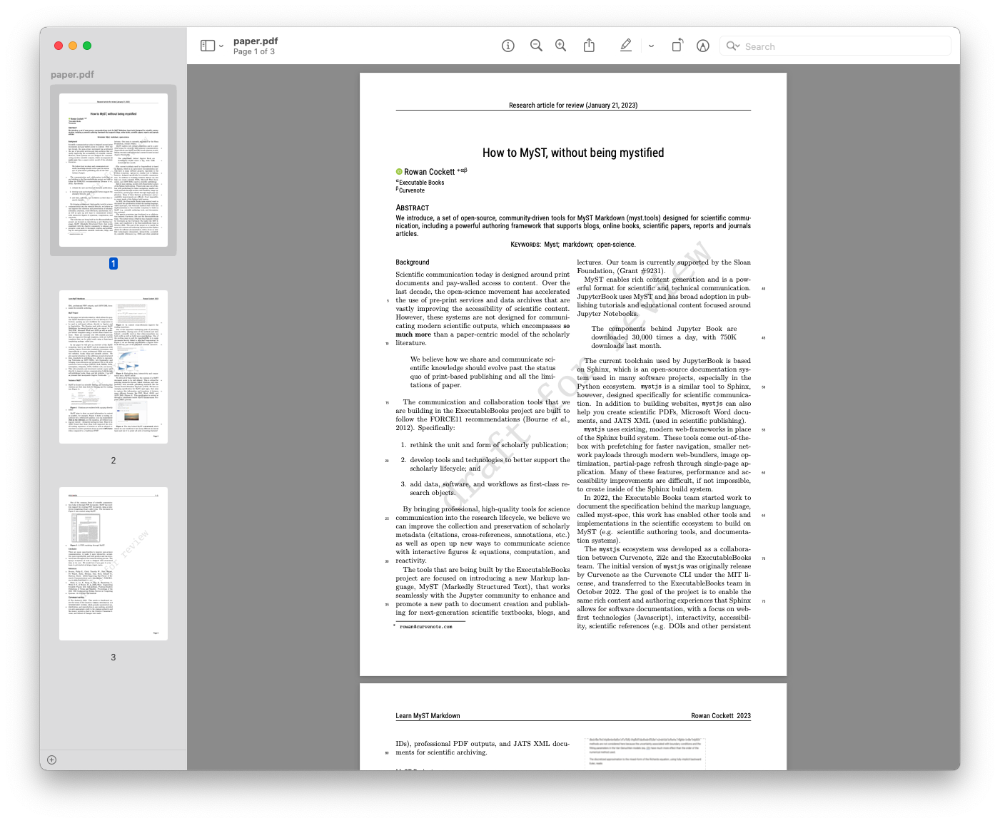

# Biophysics and BioImaging

This repository contains the files used in the [quickstart guide](https://myst.tools/docs/mystjs/quickstart), and can be used to follow that guide, before trying MyST with your own content.

> **Note** This is **not** a good example of an actual myst project! The repositories purpose is to be a simple markdown + notebook repository that can be transformed throughout a tutorial.

Here's how to link [quickstart guide](https://myst.tools/docs/mystjs/quickstart).

## Improving Frontmatter and MyST Site

## Export as a PDF

