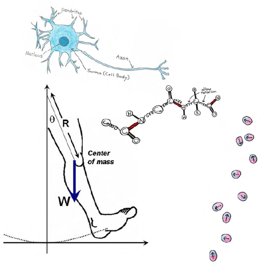

This is a biophysics textbook written by undergraduate students for undergraduate students. It covers the application of introductory- and intermediate-level physics topics to biophysical systems. It is a textbook written for junior and senior undergraduate students. Throughout the book are activities that are designed to strengthen student understanding.

