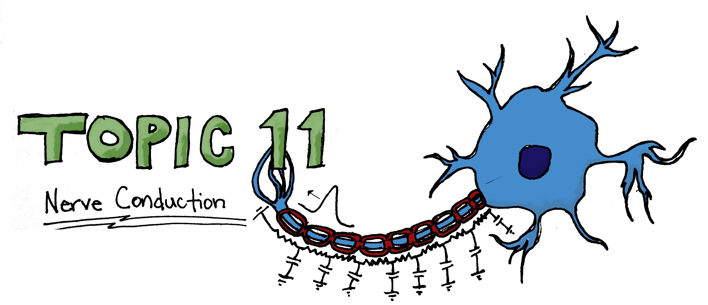

## Introduction

The human nervous system contains roughly 100 billion neurons, connected in elaborate networks that transmit information from one location in the body to another.  Consisting of the brain and spinal cord, the central nervous system interprets sensory input, initiates muscle contraction, and carries out all other cognitive tasks.  The nerves that communicate messages between the central nervous system and the rest of the body compose the peripheral nervous system.
Despite the enormous complexity of the nervous system, there are aspects of neuron function that can be understood from simple physical principles. One of those aspects is the propagation of electrical impulses along neurons.  Since neurons send information to one another via electrical signals, we can treat them like classical electrical circuits.  In this topic we will review basic concepts in neurobiology and then describe the circuit model.  

## Neurobiology Review

Neurons can be divided into three main parts: the soma, or cell body, which contains the nucleus and other organelles, and two types of fiber-like extensions called dendrites and axons.  Dendrites receive inputs from other cells and conduct signals towards the cell body.  Axons conduct signals away from the cell body towards their tips, where they are then passed on to other neurons or to muscle cells.  A neuron may have many dendrites but usually has only one axon, which can be as long as 1 m.  The junction between the axon of one neuron and the dendrite or cell body of another is called the synapse.  Dendrites and axons increase the distance over which cells can communicate and allow for complex neural networks that enable intelligence.    
```{figure} ./images/Topic11/Fig11-1.jpg
:label: Fig11-1
:width: 100%
:align: center
:alt: Structure of the neuron.
Structure of the neuron.
```
Information travels through a neuron in the form of an electrical impulse, called an action potential.  Action potentials are unidirectional, self-propagating changes in ion concentration over the plasma membrane, as shown below in [](#Fig11-2).
```{figure} ./images/Topic11/Fig11-2.jpg
:label: Fig11-2
:width: 80%
:align: center
:alt: A charge disturbance propagates down an axon, causing the electrical potential to change as it passes through a particular site. If an electrode is placed at this site, the 		potential there changes in time in a manner similar shown in the trace.
A charge disturbance propagates down an axon, causing the electrical potential to change as it passes through a particular site. If an electrode is placed at this site, the 		potential there changes in time in a manner similar shown in the trace.
```

In order for one neuron to pass the signal on to the next, the action potential must cross the synapse.  This can occur in one of two ways.  Electrical synapses let the signal pass unchanged—ion currents flow directly between neurons via gap junctions, allowing the action potential to pass from presynaptic to postsynaptic membranes without delay or loss of signal strength.  Chemical synapses work much differently, by a process called neurotransmission.  When the action potential reaches the synapse, the electrical signal is converted to a chemical signal, which can then be interpreted differently by the various post-synaptic cells, depending on their chemical receptors.  Chemical synapses are highly advantageous because they can be more tightly regulated than electrical synapses.

An explanation of how neurotransmission works is too complicated for our purposes, but it is worth noting that chemical synapses are either excitatory, meaning that they add to the possibility of an action potential being generated, or inhibitory, meaning that they make the event less probable.  The average neuron receives inputs from about 10,000 synapses, which must be integrated with respect to space and time.  If the spatial and temporal sum of all the potentials reaches some threshold potential ($\sim$65 mV), the neuron fires, sending an electrical signal down its axon.
```{figure} ./images/Topic11/Fig11-3.jpg
:label: Fig11-3
:width: 100%
:align: center
:alt: An action potential is generated if the spatial and temporal sum of all excitatory and inhibitory connections reaches the threshold value.
An action potential is generated if the spatial and temporal sum of all excitatory and inhibitory connections reaches the threshold value.
```

All action potentials have roughly the same strength.  Thus, the intensity of the stimulus is encoded in the frequency of action potentials rather than in their magnitude.  For example, if you burn your mouth on a hot cup of coffee, more action potentials (not stronger ones) are generated so that your brain recognizes the danger.  Signal frequency ranges from 1 to 100 action potentials per second.

While most neurons share the same basic structure, they vary greatly in length and speed of signal propagation.  In the brain where axons are as short as 0.01 mm, signals travel 0.5-2.0 m/s.  In the limbs, however, axons can be up to 1.0 m in length and carry signals at 100 m/s.  By examining the electrical properties of neurons, we can see what factors determine the speed of propagation.

## Electrical Properties of Neurons

Enclosed in the membrane of any cell is a jellylike substance that contains both inorganic and organic matter.  In the cell body, this substance is called cytoplasm, but in the axon it is called axoplasm.  For an inactive neuron, the axoplasm has an overall negative charge.  This is because proteins, amino acids, phosphates, and other negatively-charged entities inside the cell cannot cross the selectively-permeable cell membrane.  Two types of positively-charged ions, potassium (K$^+$) and sodium (Na$^+$), can cross the cell membrane through selective ion channels.  Normally there are more potassium ions inside the cell than outside, whereas there are more sodium ions outside the cell than inside.  To combat the dissipation of the concentration and electrical gradients of these ions, a chemically driven pump works to move sodium out of the cell and potassium into the cell.  Its mechanism is described in [](#Fig11-4).    
```{figure} ./images/Topic11/Fig11-4.png
:label: Fig11-4
:width: 100%
:align: center
:alt: Cyclic mechanism of the sodium-potassium pump.
Cyclic mechanism of the sodium-potassium pump.
```

Due to these ionic effects, the resting potential of the axoplasm is about -90 mV relative to the extracellular fluid.  When a neuron is stimulated, voltage-gated sodium channels open to allow sodium ions to enter the cell.  Because the positive charges make the cell less negative, this event is called depolarization.  If the potential is depolarized to -65 mV, an action potential is generated that propagates to the end of the axon.  Below this so-called threshold potential, the stimulus will propagate only a short distance down the axon before fading away.

Most neurons in vertebrate nervous systems have an insulating layer around their axons, called the myelin sheath.  The sheath is formed by supporting cells, called Schwann cells, that wrap around the axon, as shown in [](#Fig11-5). 
```{figure} ./images/Topic11/Fig11-5.jpg
:label: Fig11-5
:width: 100%
:align: center
:alt: Structure of a neuron with myelinated axon.
Structure of a neuron with myelinated axon.
```
Between Schwann cells are small regions of exposed axon called nodes of Ranvier.  These nodes contain the voltage-gated ion channels that allow action potentials to propagate down the axon, so that the signal jumps from node to node.  This method, called saltatory conduction, allows signals to propagate much faster in myelinated neurons than in those without a myelin sheath.  The neuronal membrane and myelin sheath form an insulating layer between the conducting axoplasm and extracellular fluid, as illustrated in [](#Fig11-6).
```{figure} ./images/Topic11/Fig11-6.jpg
:label: Fig11-6
:width: 100%
:align: center
:alt: Axon as an insulated wire.
Axon as an insulated wire.
```
When the action potential appears in a part of the axon, the voltage change that occurs there causes nearby charges to move toward it or away from it, as depicted in [](#Fig11-7). 
```{figure} ./images/Topic11/Fig11-7.jpg
:label: Fig11-7
:width: 70%
:align: center
:alt: Movement of charges inside the axon in response to a stimulus.
Movement of charges inside the axon in response to a stimulus.
```
It is this movement of these charges, i.e. their electrical current, that dictates how fast the action potential travels along the length of the axon. As we shall see in this topic, these currents are limited not only by the electrical resistance they encounter but also by the way they interact with charges across the membrane (the membrane capacitance).

### Resistance

In the neuron, there are two substances that exhibit electrical resistance: the axoplasm itself and the cell membrane plus myelin sheath, if present.  The electrical resistance $R$ along the length of the axon follows the same principles as a wire:
\begin{equation}\label{eqn11-1}
R=\frac{\rho\ell}{\pi r^2}
\end{equation}
where the resistivity $\rho$ is a constant that depends on the medium and $\ell$ and $r$ are the length and radius of the wire, respectively.  
```{figure} ./images/Topic11/Fig11-8.jpg
:label: Fig11-8
:width: 100%
:align: center
:alt: A wire of length l and radius r has resistance R, given by Eqn. {eq}`eqn11-1`.
A wire of length l and radius r has resistance R, given by Eqn. {eq}`eqn11-1`.
```

Intuitively this equation makes sense, because charges encounter less resistance when they travel shorter distances (smaller $\ell$) or when there are more pathways through which they can travel (larger cross section $\pi r^2$).

For both myelinated and unmyelinated neurons, the resistivity $\rho$ of the axoplasm is 2.0 $\Omega\cdot$m.  If the average neuron has an axon 1 mm long and a 5 $\mu$m radius, we can use Eqn. {eq}`eqn11-1` to find that the resistance of the axoplasm $R_{\rm axoplasm} = 2.5\times10^7~\Omega$.  This huge value indicates that axons are actually poor electrical conductors.

The cell membrane is also permeable to charge; its resistance is not infinite, even when myelinated.  Rather than depending on cross-sectional area, the resistance through the membrane depends on the surface area of the axonal membrane:
\begin{equation}\label{eqn11-2}
R=\frac{\rho}{2\pi r\ell}
\end{equation}
For an unmyelinated axon (UA), $\rho_{\rm UA} = 0.20~\Omega\cdot {\rm m}^2$.  So, again for an average axon 1 mm long with radius 5 $\mu$m, $R_{\rm UA} = 6.4\times10^6~\Omega$.  Myelinated axons (MA) have a much higher resistivity, $\rho_{\rm MA} = 40.0~\Omega\cdot {\rm m}^2$, so $R_{\rm MA} = 1.3\times10^7~\Omega$.

### Capacitance

Recall that a capacitor is an electrical device that stores charge.  It consists of two conductors side by side, separated by some insulating substance called the dielectric. The ability to store charge comes from the attraction that charges in one plate experience toward the charges in the other. A simple capacitor, like the one below, requires a voltage to be applied across the conducting metal plates first, in order to move the charges from one plate to the other.  If both sides were electrically neutral to begin with, then moving positive charges from one plate automatically implies that a net negative charge of identical magnitude is left behind. 
```{figure} ./images/Topic11/Fig11-9.png
:label: Fig11-9
:width: 100%
:align: center
:alt: A parallel plate capacitor.
A parallel plate capacitor.
```
The amount of charge $Q$ that can be drawn from one to the other depends not only on the voltage $V$ apllied across the plates, but also on the separation $d$ between the two plates, and the total surface area $A$ between them:  
$$Q=\frac{\epsilon AV}{d}$$
The amount of charge stored for every volt applied across it, that is $Q/V$, is referred to as capacitance, $C$. The capacitance of a parallel plate capacitor is therefore 
\begin{equation}\label{eqn11-3}
C=\frac{\epsilon A}{d}
\end{equation}
In Eqn. {eq}`eqn11-3`, $\epsilon$ is a constant varies depending on the dielectric material present between the conducting plates. This constant is known as the permittivity.

Again, the equation makes sense intuitively because the larger the surface area between the plates the more charge can be stored. Furthermore, the smaller their separation, the greater the attraction between the charges, which also increases the capacity for charge storage.

For a lipid bilayer, $\epsilon = 5\times10^{-11}$ F/m (F is the symbol for Farad, the SI unit of capacitance) and $d = 50~\text{\AA} = 5\times10^{-9}$ m.  Thus, the capacitance per unit area for an unmyelinated axon is
$$\frac{C}{A}=\frac{\epsilon}{d}= \frac{5\times10^{-11}}{5\times10^{-9}}=10^{-2}{\rm F/m}^2~~ {\rm (unmyelinated~axon)}$$
For myelinated axons, the myelin sheath contains a membrane that wraps around the axon a couple of hundred times. This multilayer arrangement effectively increases the thickness of the lipid bilayer by a factor of 200 (1 $\mu$m total thickness), so capacitance per unit area for a myelinated axon is:
$$\frac{C}{A}=\frac{\epsilon}{d}= \frac{5\times10^{-11}}{1\times10^{-6}}=5\times10^{-5}{\rm F/m}^2~~ {\rm (myelinated~axon)}$$

### Summary of Electrical Properties

The electrical properties of neurons are summarized by [](#Fig11-10) and [](#table11-1) below.
 ```{figure} ./images/Topic11/Fig11-10.jpg
:label: Fig11-10
:width: 100%
:align: center
:alt: The physical model shows wires, two resistors, and a capacitor that approximate the physical flow of charge through real axons.
The physical model shows wires, two resistors, and a capacitor that approximate the physical flow of charge through real axons.
```
:::{table} Useful constants.
:label: table11-1
:align: center
|                       | Unmyelinated Axon (UA)                   | Myelinated Axon (MA)|
|:---------------------:|:----------------------:                  |:-------------------:|
| axoplasm resistivity  | $\rho_{\rm axoplasm} = 2.0~\Omega\cdot$m | $\rho_{\rm axoplasm} = 2.0~\Omega\cdot$m|
| wall resistivity      | $\rho_{\rm UA} = 0.20~\Omega\cdot$ m$^2$ | $\rho_{\rm MA} = 40.0~\Omega\cdot$m$^2$|
| wall capacitance/area | C/A = 10$^{-2}$ F/m$^2$                  | C/A = 5$\times10^{-5}$ F/m$^2$|
:::

## Interpretation of Impulse Propagation 

As explained in the Introduction, neurons are connected so that action potentials travel between them in only one direction.  The electrical properties of nerve cells discussed in the last section suggest that impulse propagation can be modeled as an array of resistors and capacitors, as shown below in [](#Fig11-11).
```{figure} ./images/Topic11/Fig11-11.jpg
:label: Fig11-11
:width: 100%
:align: center
:alt: Physical model of neural connections.
Physical model of neural connections.
```
The analysis of this electric circuit is complex, requiring the use of differential equations, but we can gain insight by considering how each repeating unit modifies the electrical signal.

### Propagation Speed

For simplicity, we will at first ignore the wall resistance.  For one circuit unit (i.e. one neuron), the voltage changes over time according to the equation
\begin{equation}\label{eqn11-4}
V(t)=V_{\circ}\left(1-{\rm e}^{\frac{-t}{RC}}\right)
\end{equation}
where $V_{\circ}$ is the resting potential and $R$ is the axoplasm resistance.  Eqn. {eq}`eqn11-4` is graphed below.
```{figure} ./images/Topic11/Fig11-12.jpg
:label: Fig11-12
:width: 100%
:align: center
:alt: Voltage $V_1$ of a single neuron as a function of time.
Voltage $V_1$ of a single neuron as a function of time.
```  

By convention, the time required for the exponential term e$^{-t/RC}$ to reach e$^{-1}$ is defined as the charging time.  Thus, for this simple circuit, the charging time is $\tau = R_{\rm axoplasm}C$.

When we add another unit, the problem gets a bit more complicated.  According to the model, the first unit charges up before the second unit begins to charge.  With every additional unit, there is an additional delay of$\tau = R_{\rm axoplasm}C$.
```{figure} ./images/Topic11/Fig11-13.jpg
:label: Fig11-13
:width: 100%
:align: center
:alt: The circuit with two neurons charges twice as slow as the circuit with one.
The circuit with two neurons charges twice as slow as the circuit with one.
```  

Since a unit must charge completely before it can discharge to the next unit (like the all-or-none action potential), there is a time delay equal to $\tau$ in the propagation of the electrical signal between two units.  If the length of each unit is $x$, then the speed of propagation is given by
$$v = \frac{x}{\tau}=\frac{x}{R_{\rm axon}C}$$
Substituting the expressions for the resistance of the axoplasm $R_{\rm axoplasm} = \rho_ax/\pi r^2$ and the capacitance of the membrane $C = c2\pi rx$ into the expression for the velocity we obtain:
\begin{eqnarray}\label{eqn11-5}					 	
v &=& \frac{x}{\left(\frac{\rho_{\rm axon}x}{\pi r^2}\right)\left(c 2\pi r x\right)}\nonumber\\
&=& \frac{r}{2\rho_{\rm axon}cx}
\end{eqnarray}
The $r$ dependence in the numerator of Eqn.{eq}`eqn11-5` accounts for a fundamental rule of neurobiology: the wider the axon, the faster the axonal speed of propagation.
For myelinated neurons, the myelin sheath covers the axon in 1 mm-long sections.  Thus, within each myelinated section, one would predict that $$v=5\times10^{-6}~{\rm m}/\left(2\cdot2.0~\Omega{\rm m}\cdot5\times10^{-5}~{\rm F/m}^2\cdot1\times10^{-3}{\rm m}\right)\approx 20 {\rm m/s}.$$  For unmyelinated neurons, for which c $\sim 10^{-2}$ F/m$^2$, the speed of propagation is 200 times slower or 0.1 m/s. Clearly the latter would not be suited for nerve communication over long distances.

Recall that our calculations do not take into account the resistance of the cell membrane and myelin sheath.  Including it leads to leakage of the electrical signal through the wall, called signal attenuation.  For a single unit, the effect is profound, as shown below.  
```{figure} ./images/Topic11/Fig11-14.jpg
:label: Fig11-14
:width: 100%
:align: center
:alt: The voltage is much lower if we consider the wall resistance.
The voltage is much lower if we consider the wall resistance.
``` 
Note that the two resistors in [](#Fig11-14) are in series. Such a sequence of resistors acts as a voltage divider, that is, the voltage across $R_{wall}$ is a fraction of $V_{\circ}$ given by $R_{wall}/\left(R_{axon}+R_{wall}\right)$. You can infer from this that the signal decreases by this factor every time it propagates through one of these segments. Therefore, as the signal propagates through several such segments, the voltage decreases geometrically with the number of units traveled, i.e.  
\begin{equation}\label{eqn11-6}
v=v_{\circ}{\rm e}^{-\frac{x}{\lambda}}
\end{equation}
where $x$ is the distance traveled down the circuit.  The value of $\lambda$ is 0.05 cm for unmyelinated neurons and 0.7 cm for myelinated neurons.  When we graph Eqn. {eq}`eqn11-6`, we see that myelinated nerve fibers carry nerve impulses farther.
```{figure} ./images/Topic11/Fig11-15.png
:label: Fig11-15
:width: 100%
:align: center
:alt: Signals travel farther through myelinated axons.
Signals travel farther through myelinated axons.
``` 

According to our estimates, nerve impulses cannot travel much more than about 1 cm.  But we know that some axons in the body can be up to 1 m long!  In order to allow their signals to travel greater distances, neurons amplify their signals chemically.  The mechanism, shown in [](#Fig11-16), employs membrane-bound protein channels that act as ion gates. One type of gate allows some of the abundant Na$^+$ ions in the extracellular fluid to briefly diffuse into the cell. This infusion of positive ions amplifies the action potential.  Shortly after the Na$^+$ channel closes, another type of membrane channel open. This channel allows some of the abundant K+ ions to diffuse out of the cell, to the point they nullify completely and rapidly the action potential. In this way, the neuron is promptly readied for additional stimuli.

Once positive charges diffuse into one area of the membrane, it creates an increased potential that affects neighboring ion gates, as shown in [](#Fig11-16). This triggers a chain reaction, whereby neighboring gates open and allow charge to diffuse in, which activate gates still further down the membrane, and so on.

Although the potential returns to normal after the K$^+$ channels open, [](#Fig11-16) clearly indicates that the concentrations of Na$^+$ outside and K$^+$ inside the cell decrease after a neuron is activated one. Although the remaining concentrations are sufficient to amplify additional action potentials, eventually these concentrations must be returned to their original levels. This is why the sodium-potassium pump described in [](#Fig11-3)  is so critical to maintaining those ionic concentrations for proper neuronal function.
```{figure} ./images/Topic11/Fig11-16.jpg
:label: Fig11-16
:width: 100%
:align: center
:alt: Propagation and amplification of the action potential in an unmyelinated axon.
Propagation and amplification of the action potential in an unmyelinated axon.
```

### Saltatory Conduction

As indicated above, action potentials travel rapidly through myelinated portions of axons because the membrane capacitance is much smaller in those regions. This is particularly advantageous when signals must transmit information over long distances. The range of travel is, however, limited to a few millimeters before the signal decays. For unmyelinated axons equipped with membrane ion channels, the signals can propagate indefinitely without loosing strength, but at a remarkably slow speed. To overcome the problem of long-distance communication without loss of signal, nature has developed a clever scheme that combines the advantages of myelinated and unmyelinated axons. The scheme is shown below in [](#Fig11-17). Signals are allowed to propagate freely the length of myelinated portions, measuring roughly 1 mm each, until they reach the gaps (or nodes). There, the exposed part of the axon contains ion channels that boost the strength of the action potential back to its maximal value. Although the speed of propagation is slower there, the relative shortness of these segments (about 2 $\mu$m) imposes only a negligeable decay. Thus, as the action potential travels through these long axons, the action potential within appears to jump from node to node as it speeds through myelinated portions and slows at the nodes. This form of conduction is known as saltatory, a word derived from the latin to jump.
```{figure} ./images/Topic11/Fig11-17.png
:label: Fig11-17
:width: 100%
:align: center
:alt: Propagation of action potentials through myelinated and unmyelinated regions of a myelinated axon.
Propagation of action potentials through myelinated and unmyelinated regions of a myelinated axon.
``` 
